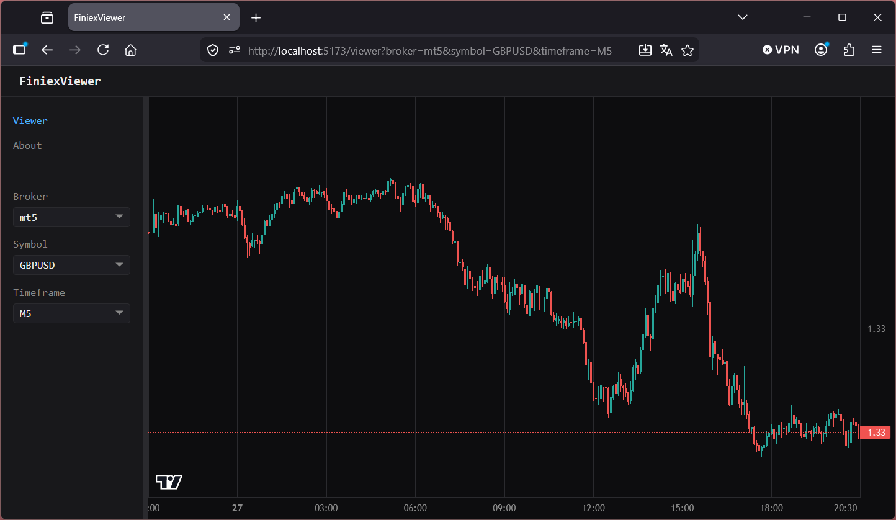

# FiniexViewer

> **Version:** v0.2.1 Pre-Alpha Showcase
> **Status:** v0.2.1 — candle chart, selector, shareable links, unit test coverage, CI pipeline.

A web-based viewer companion for **[FiniexTestingIDE](https://github.com/dc-deal/FiniexTestingIDE)**.

Read-only candle chart that loads historical bar data from a running FiniexTestingIDE API server. Pick a broker, a symbol, a timeframe — the chart loads. The URL is shareable and survives page reload.



---

## What This Is

- A **separate repository** that talks to FiniexTestingIDE over HTTP — no shared filesystem.
- A **Vue 3 / TypeScript / Vite** single-page application, dark mode by default.
- A **read-only candle viewer** — no trade execution, no scenario control.

## What This Is Not

- Not a trading platform or execution UI.
- Not a strategy runner — no simulation control from the browser.
- No authentication, no user accounts, no multi-user setup.
- Not a replacement for the FiniexTestingIDE CLI.

---

## Getting Started

### Prerequisites

- **FiniexTestingIDE** cloned and its API server running — FiniexViewer has no data of its own.
- **Node.js 18+** and **npm**.

### Setup

```bash
git clone https://github.com/dc-deal/FiniexViewer.git
cd FiniexViewer
npm install
```

Create `.env.local` to point at your API server (default is `http://localhost:8000` — skip if that matches):

```bash
echo "VITE_API_BASE_URL=http://localhost:8000" > .env.local
```

### Run

```bash
# Start the FiniexTestingIDE API server first:
python python/cli/api_server_cli.py --reload   # inside FiniexTestingIDE

# Then start the Vite dev server:
npm run dev
```

Open **[http://localhost:5173/viewer](http://localhost:5173/viewer)**.

### Docker Compose (dual-repo setup)

If you use the FiniexTestingIDE devcontainer, the dual-container setup is documented in [FiniexTestingIDE — FiniexViewer Setup Guide](../FiniexTestingIDE/docs/user_guides/finiexviewer_setup.md).

---

## Tech Stack

| Layer | Choice |
|---|---|
| Build tool | **Vite 6** |
| Framework | **Vue 3** — Composition API, `<script setup>` |
| Language | **TypeScript** |
| State | **Pinia** |
| Routing | **Vue Router 4** |
| Charts | **Lightweight Charts** (TradingView) |
| HTTP client | **axios** |
| Layout | **splitpanes** |
| Theme | CSS Custom Properties token system, dark/light mode |
| Linting | **ESLint 9** + `eslint-plugin-vue` + `@vue/eslint-config-typescript` |
| Testing | **Vitest** + **Vue Test Utils** — unit tests, jsdom environment |
| CI | **GitHub Actions** — type-check + tests on every PR and push to master |

Architecture and tech decisions: [docs/frontend_architecture.md](docs/frontend_architecture.md)

---

## Architecture

```
┌─────────────────────────┐        HTTP / REST        ┌──────────────────────────┐
│     FiniexViewer        │ ◄───────────────────────► │   FiniexTestingIDE       │
│  (Vue 3, TypeScript)    │     /api/v1/brokers/...    │   (Python, FastAPI)      │
│                         │                            │                          │
│  - Broker/Symbol picker │                            │  - Parquet tick reader   │
│  - Candle chart         │                            │  - Bar index manager     │
│  - Shareable URL state  │                            │  - Scenario engine       │
└─────────────────────────┘                            └──────────────────────────┘
```

Two-container topology and request flow: [docs/frontend_architecture.md](docs/frontend_architecture.md)

---

## Development Commands

```bash
npm run dev          # start Vite dev server
npm run build        # production build
npm run type-check   # TypeScript check without emit
npm run test         # run unit tests (Vitest)
npm run test:coverage  # run tests with coverage report
```

---

## License

MIT — see [LICENSE](LICENSE).

## Disclaimer

Pre-release alpha under active development. Features, APIs, and architecture may change without notice. Provided as-is for research and educational purposes. Nothing in this project constitutes financial advice.
