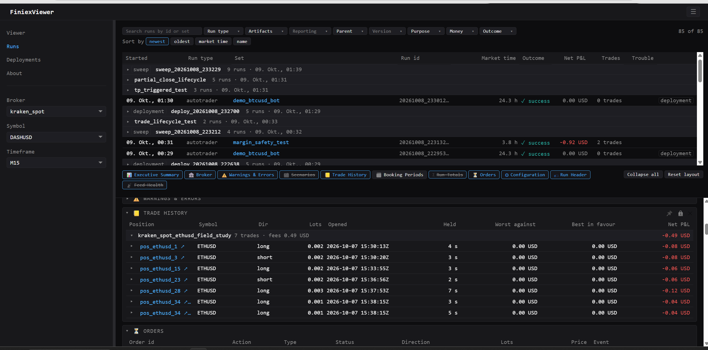
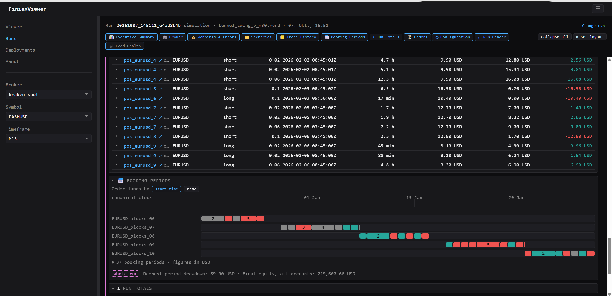
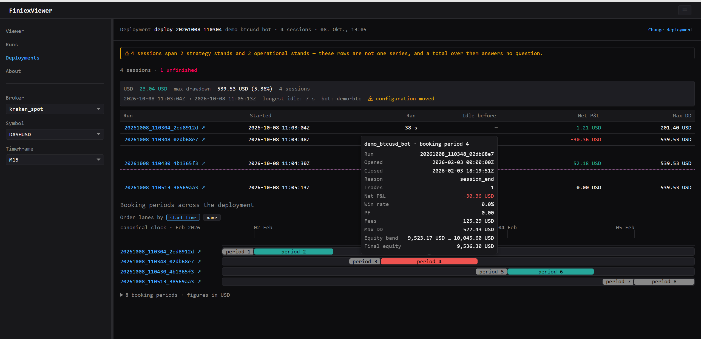
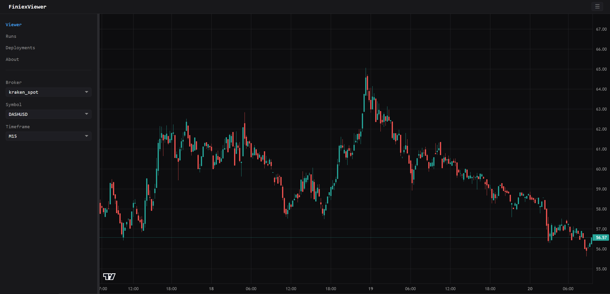

# FiniexViewer

> **Version:** v0.3.0 Pre-Alpha Showcase
> **Status:** v0.3.0 — run inspection. Eleven report panels over a run's stored artifacts, a
> deployment's session history, the candle chart, shareable links, 833 unit tests and a browser
> suite.

A web-based viewer companion for **[FiniexTestingIDE](https://github.com/dc-deal/FiniexTestingIDE)**.

It reads what a backtest or an AutoTrader session LEFT BEHIND and puts it on one screen: the orders
a strategy submitted and what became of each one, the trades they produced, the periods the run was
booked into, the warnings a validator raised, and the configuration it all ran under. Nothing is
recomputed here — every figure is a field the API served, or it is asked for as one.

The candle chart it started as is still there, and the URL of any view is shareable and survives a
reload.



**A run, from the list down to one order.** The list folds eighty-five runs into forty-two lines @
the children of one sweep or one deployment session stand under a single heading — and a chosen run
opens the panels beneath it.



**Where a run was booked.** Each unit's periods as a lane on one canonical clock, and every trade
one click from the orders that produced it.



**A live bot across its restarts.** Sessions are separate runs, so the view says when they are not
one series rather than adding them up — and the periods of all of them share one clock.



**The chart.** Broker, symbol, timeframe; a default window per timeframe; the whole selection in
the URL.

---

## What This Is

- A **separate repository** that talks to FiniexTestingIDE over HTTP — no shared filesystem.
- A **Vue 3 / TypeScript / Vite** single-page application, dark mode by default.
- A **read-only viewer** — candle chart, run reports, and a live bot's history across its restarts. No trade execution, no scenario control.
- **Nothing is derived here.** A figure a panel shows is a field the API served. Where one would have to be computed, that is a request to the backend rather than three lines of arithmetic with a second source of truth.

## What This Is Not

- Not a trading platform or execution UI.
- Not a strategy runner — no simulation control from the browser.
- No login, no user accounts, no multi-user setup.
- Not a replacement for the FiniexTestingIDE CLI.

---

## Getting Started

### Prerequisites

- **FiniexTestingIDE** cloned and its API server running — FiniexViewer has no data of its own.
- **Node.js 18+** and **npm**.

### Setup

```bash
git clone https://github.com/dc-deal/FiniexViewer.git
cd FiniexViewer
npm install
```

Create `.env.local` to point at your API server (default is `http://localhost:8000` — skip if that matches):

```bash
echo "VITE_API_BASE_URL=http://localhost:8000" > .env.local
```

If the API requires a bearer token, put it in the same file:

```bash
echo "FINIEX_API_TOKEN=<your token>" >> .env.local
```

**Note the missing `VITE_` prefix, and do not add one.** A `VITE_*` variable is inlined into the
browser bundle at build time, which would publish the token to anyone who opens the page. This one
is read by the dev proxy and attached to the outgoing request, so the browser never receives it.
Leave it unset and no `Authorization` header is sent.

### Run

```bash
# Start the FiniexTestingIDE API server first:
python python/cli/api_server_cli.py --reload   # inside FiniexTestingIDE

# Then start the Vite dev server:
npm run dev
```

Open **[http://localhost:5173/viewer](http://localhost:5173/viewer)**.

### Docker Compose (dual-repo setup)

If you use the FiniexTestingIDE devcontainer, the dual-container setup is documented in [FiniexTestingIDE — FiniexViewer Setup Guide](../FiniexTestingIDE/docs/user_guides/finiexviewer_setup.md).

---

## Tech Stack

| Layer | Choice |
|---|---|
| Build tool | **Vite 6** |
| Framework | **Vue 3** — Composition API, `<script setup>` |
| Language | **TypeScript** |
| State | **Pinia** |
| Routing | **Vue Router 4** |
| Charts | **Lightweight Charts** (TradingView) |
| HTTP client | **axios** |
| Layout | **splitpanes**, **vue-draggable-plus** for the panel order |
| Headless components | **Reka UI** — collapsible, toggle group, popover, hover card |
| Theme | CSS Custom Properties token system, dark/light mode |
| Linting | **ESLint 9** + `eslint-plugin-vue` + `@vue/eslint-config-typescript` + `@stylistic` |
| Dead code | **knip** — unreferenced files, exports and dependencies |
| Testing | **Vitest** + **Vue Test Utils** — unit tests, jsdom environment |
| Browser tests | **Playwright** — a real reload, a real URL, real geometry; hygiene rather than a gate |
| CI | **GitHub Actions** — type-check + tests on every PR and push to master |

Architecture and tech decisions: [docs/frontend_architecture.md](docs/frontend_architecture.md)

---

## Architecture

```
┌─────────────────────────┐        HTTP / REST        ┌──────────────────────────┐
│     FiniexViewer        │ ◄───────────────────────► │   FiniexTestingIDE       │
│  (Vue 3, TypeScript)    │     /api/v1/brokers/...    │   (Python, FastAPI)      │
│                         │                            │                          │
│  - Broker/Symbol picker │                            │  - Parquet tick reader   │
│  - Candle chart         │                            │  - Bar index manager     │
│  - Run report panels    │                            │  - Scenario engine       │
│  - Deployment history   │                            │  - Run-results ledger    │
│  - Shareable URL state  │                            │                          │
└─────────────────────────┘                            └──────────────────────────┘
```

Two-container topology and request flow: [docs/frontend_architecture.md](docs/frontend_architecture.md)

---

## Development Commands

```bash
npm run dev          # start Vite dev server
npm run build        # production build
npm run type-check   # TypeScript check without emit
npm run lint         # ESLint with autofix (lint:check to only report)
npm run knip         # report unreferenced files, exports and dependencies
npm run test         # run unit tests (Vitest)
npm run test:coverage  # run tests with coverage report
npm run preview      # serve the production build
npm run test:e2e     # browser suite (needs a browser; see below)
```

The browser suite needs a browser, and the container has none — the image is Alpine on musl while
Playwright's browsers are glibc builds. One script does the whole procedure, including killing the
browser afterwards whatever happened:

```bash
bash scripts/e2e.sh                 # the whole suite
bash scripts/e2e.sh e2e/one.spec.ts --workers=1
```

---

## License

MIT — see [LICENSE](LICENSE).

## Disclaimer

Pre-release alpha under active development. Features, APIs, and architecture may change without notice. Provided as-is for research and educational purposes. Nothing in this project constitutes financial advice.
